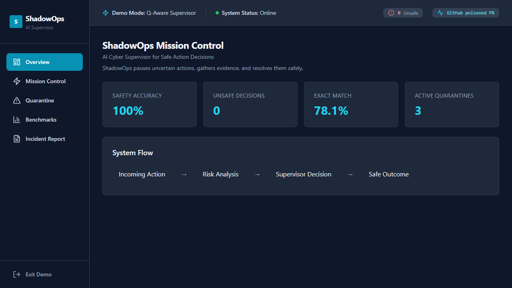

# ShadowOps Hackathon

> **Status: Experimental / Hackathon Prototype** — The lightweight backend suite and frontend checks pass; the CUDA training pipeline was not reproduced in this audit.

[](docs/demo/demo.webm)

> Watch the locally recorded safety-dashboard overview; it does not claim that the CUDA training pipeline was rerun.

ShadowOps is an OpenEnv-compatible autonomous cybersecurity incident-response environment. It evaluates whether an agent should `ALLOW`, `BLOCK`, `FORK`, or `QUARANTINE` operational actions across GitHub CI/CD, cloud IAM, S3/public storage, firewall, pentest, deployment, and multi-step attack-chain scenarios.

## Ownership and attribution

GitHub correctly displays this repository as a fork of [`ybaddam8-png/shadowops-hackathon`](https://github.com/ybaddam8-png/shadowops-hackathon). It is a collaborative hackathon codebase and must not be read as a sole-authorship project.

- The upstream repository contains the shared environment, training work, model artifacts, and later validation improvements.
- The fork's pre-portfolio `main` contains two integration/submission commits authored by `machander-byte`, including the Qwen3 GRPO weight merge.
- Git history also records a backend-agent contribution from `badugujashwanth-create` merged upstream through pull request #4.
- The current `portfolio-polish` branch adds the lightweight test dependency correction, CI verification, portfolio documentation, and the safe dashboard demo/captions under Jashwanth Badugu's authorship.
- The Qwen adapter and training evidence are collaborative/upstream artifacts. This account does not claim sole authorship of the training run or the reported model results.

For an interview, the defensible individual contribution is the backend-agent work visible in history plus the fork's reproducibility, CI, documentation, and demo improvements. The project is therefore retained as collaborative/experimental work and is not selected as a top portfolio pin.

## Model-artifact merge status

This fork includes the Qwen3-1.7B GRPO LoRA adapter incorporated from the collaborative upstream work.

Copied adapter path:

- `backend-ml/shadowops_qwen3_1p7b_model/`

The adapter is stored with Git LFS because `adapter_model.safetensors` is larger than GitHub's normal 100 MB file limit.

## Current Verified Baseline

These values are loaded from the repository artifact `backend-ml/training/demo_benchmark_report.json`.

| Policy | exact_match | safety_accuracy | unsafe_decision_rate | false_positive_rate | reward_mean |
| --- | ---: | ---: | ---: | ---: | ---: |
| Random | 0.360 | 0.800 | 0.200 | 0.163 | 0.083 |
| Heuristic | 0.520 | 0.920 | 0.080 | 0.000 | 1.146 |
| Q-aware | 0.990 | 1.000 | 0.000 | 0.000 | 1.920 |
| Oracle | 1.000 | 1.000 | 0.000 | 0.000 | 1.942 |

## Trained Checkpoint Evidence

The merged repo includes a real GRPO LoRA adapter and its `trainer_state.json` from Repo B. The trainer state records a 250-step GRPO run and is copied into:

- `backend-ml/shadowops_qwen3_1p7b_model/trainer_state.json`
- `backend-ml/training/imported_artifacts/qwen3_grpo_final_v2/trainer_state.json`

Deployment-quality model claims should be made only after `model_eval_report.json` or `checkpoint_comparison_report.json` is regenerated by loading this adapter and comparing it against the Q-aware policy. The default laptop-safe path remains the Q-aware supervisor.

## Run Backend

Laptop-safe Q-aware demo mode:

```powershell
cd backend-ml
uvicorn main:app --host 0.0.0.0 --port 8000
```

Real model mode with the transplanted LoRA adapter:

```powershell
cd backend-ml
$env:USE_REAL_MODEL="true"
$env:SHADOWOPS_BASE_MODEL="unsloth/Qwen3-1.7B"
$env:SHADOWOPS_ADAPTER_PATH="./shadowops_qwen3_1p7b_model"
uvicorn main:app --host 0.0.0.0 --port 8000
```

## Run Frontend

```powershell
cd frontend
npm install
$env:VITE_API_BASE_URL="http://localhost:8000"
npm run dev
```

The frontend API helper calls the FastAPI `/health` and `/decision` endpoints and falls back to local demo data if the backend is offline.

## Evaluation Commands

Baseline and judge reports:

```powershell
cd backend-ml
python training/train_qwen3_grpo.py --evaluate-baselines-only --skip-model-load
python training/run_hidden_eval.py
python training/generate_judge_report.py
python demo_judge.py
```

Checkpoint evaluation after GPU/Unsloth dependencies are available:

```powershell
cd backend-ml
python training/train_qwen3_grpo.py --evaluate-model --model-path shadowops_qwen3_1p7b_model --compare-against-policy
```

## Judge Claim

ShadowOps proves a strong OpenEnv cybersecurity RL environment with a reproducible Q-aware policy guardrail, strict four-action output format, hidden evaluation, replay attacks, evidence planning, and multi-step risk memory. The transplanted Qwen3-1.7B GRPO LoRA adapter is wired for real-model inference; final model-vs-policy claims should be based on regenerated checkpoint evaluation artifacts.
