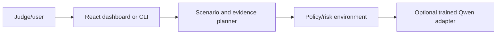

# ShadowOps Safety Lab architecture

Hackathon environment for evaluating and demonstrating safe agent decisions, policy constraints, replayable scenarios, and trained-adapter evidence.

## System view

## Component boundaries

- **Judge/user:** initiates the primary workflow.
- **React dashboard or CLI:** owns one stage of the request or interaction flow.
- **Scenario and evidence planner:** owns one stage of the request or interaction flow.
- **Policy/risk environment:** owns one stage of the request or interaction flow.
- **Optional trained Qwen adapter:** provides the terminal integration or persistence boundary.

## Runtime and trust boundaries

The full CUDA training path was not reproduced. The 133 MB adapter is already managed through Git LFS; a release asset may still reduce clone friction for portfolio visitors. Inputs crossing a network, filesystem, provider, or database boundary should be validated and logged without sensitive values. Optional integrations must fail clearly rather than being presented as successful.

## Technology

Python, FastAPI, Pydantic, NumPy, React/TypeScript, optional PyTorch/Unsloth/vLLM.
